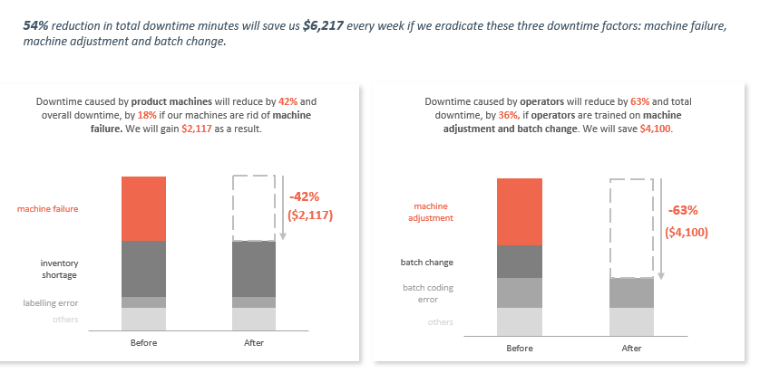

# Project Background
Jones Soda, a specialty beverage manufacturer known for its flavored sodas, initiated a production analysis project aimed at **reducing operational inefficiencies caused by recurring production line downtime**. The project was commissioned in response to rising internal costs, inconsistent batch performance, and delayed order fulfillment attributed to both machine malfunctions and operator errors.

The primary objective of this project is to analyze, visualize, and interpret production line data with a specific focus on **identifying root causes of downtime, quantifying their impact on operational performance, and providing actionable insights that will help Jones Soda reduce downtime by at least 50%**.
  

### Key Analysis & Recommendation Areas
* Machine-Side Downtime Diagnosis:
Identifies and quantifies downtime due to machine-related issues (e.g., failures, jams, inventory shortages). 

* Operator Performance Review:
Evaluates operator-specific errors, including machine misadjustments and inefficiencies during batch changes. Tracks downtime minutes and costs attributable to each operator, and pinpoints common error types.

* Operator-Machine Specialization Profiling:
Attempts to determine which operators perform best on which production lines by comparing error type frequency to number of batches handled—guiding smarter workforce assignments.

* Product-Level Vulnerability Assessment:
Maps downtime causes across different soda products (e.g., Cola, Lemon Lime, Orange).   

*Interact with the dashboard [here](https://ooojege-my.sharepoint.com/:x:/g/personal/blessing_ooojege_onmicrosoft_com/ERtvZqVV_U9BmnMzlDfTnBcBf2UNfCGYMPeL3O5OI3iXrA?e=N2YNZB "Report")*

*Download PDF Report [here](https://ooojege-my.sharepoint.com/:b:/g/personal/blessing_ooojege_onmicrosoft_com/EVp77krmeLdBljMex7UlDRoBUnaYf8pxRNSxAzzAdoixMQ?e=Dn4SGe "PDF")*

*SQL Queries used to inspect and perform analysis can be found [here](https://ooojege-my.sharepoint.com/:w:/g/personal/blessing_ooojege_onmicrosoft_com/EcLamtNtfyVLi0pPFNRnPEEBJlLqak_FxwqDwZkkqxs2Mw?e=kwseyi)*
  

# Data Structure

Jones' data contains four tables: downtime factors, products, line productivity, line downtime. 

  

  

# Executive Summary
Over a 5-day observation period covering 4 operators and 38 production batches, Jones Soda experienced a level of downtime that significantly impacted operational efficiency and financial performance. 

**In total, 1,388 minutes of production were lost due to inefficiencies on operator and production line side**. When converted into hours, this adds up to approximately 23.13 hours, almost equivalent to losing all 4 operator's full shift of production time just within a single week.

Financially, the cost of this downtime is considerable. At the rate of $500 per hour of downtime, **the total loss amounted to $11,566.67** that could otherwise be allocated to growth activities, maintenance improvements, or employee development. **On average, each batch experienced 36.5 minutes of downtime and an average downtime cost of $304.39 per batch**.

The sections that follow will explore which machines, operators, and factors are contributing most to this problem and offer targeted recommendations for cutting downtime by at least 50%.

  
# Insights

### 1.  How did Each Operator do Last Week?

* Charlie's Downtime Summary: Charlie recorded the **highest total downtime minutes and cost among all operators, at 384 minutes and $3,200 respectively**. He was responsible for managing **11 batches**, with **each batch averaging 34.91 minutes of downtime and costing the company approximately $290.91**. Charlie’s most affected day was Monday, where he lost 3.18 hours of production time—more than half of his total downtime. Over the course of the week, Charlie worked 24 hours and lost a quarter of those hours to downtime.

  

* Dee's Downtime Summary: Dee also managed **11 batches**, similar to Charlie, but with **slightly lower downtime at 370 minutes**. This downtime cost the company an **estimated $3,083**. On average, **each of Dee’s batches lost 33.64 minutes to downtime and cost around $280.30**. His worst day was Monday, which saw 2.72 hours of lost production. And like Charlie, Dee lost a quarter to downtime throughout the week.

  

* Dennis' Downtime Summary: Dennis had the shortest shift time overall, working only 16 hours. Despite this, **he experienced 302 minutes of downtime**, a very high proportion compared to the time he actually worked. He handled **8 batches**, and each **experienced an average of 37.75 minutes of downtime, costing approximately $314.58**. This makes Dennis an expensive operator in terms of downtime per batch. His most affected day was Friday, with 2.55 hours of downtime. Since Dennis only worked 16 hours total, losing 5 hours means that nearly a third of his working time was non-productive.

  

* Mac's Downtime Summary: Mac’s **total downtime was 332 minutes, costing the Jones Soda approximately $2,767**. He also worked with **8 batches**, but unlike Dennis, **Mac recorded the highest downtime cost and duration per batch**. Each of his batches **averaged 41.5 minutes of lost time, costing about $345.83 per batch**. His most affected day was on Thursday, where he lost 3.42 hours in a 7 and half hour shift. Over his 24-hour shift span, he lost more than 5 hours.

  

  

### 2.  How did Jones Soda Loose Money?
**They lost money on two sides...machine side and operator side.**
 

#### 2a. Machine Side

* Machine Failure: **The most costly and frequent downtime factor**. Out of all the recorded reasons for downtime, machine failure **was responsible for 254 minutes, which makes up over 41% of total machine-related downtime**. The Orange, 600 ml production line was affected the most by this factor and in contrast, the Lemon Lime, 600 ml machines had zero downtime from machine failure.

* Inventory Shortages: **A major problem for cola machines.** A total of **108 minutes** of production time were lost due to shortage of materials. This issue hit the Cola, 600 ml machine hardest. Interestingly, Orange, 600 ml machine didn’t lose any time due to inventory shortages.

* Labeling Errors: Though it only **caused 22 minutes of downtime**, labeling issues are worth noting as they **affected mainly the Cola, 2 L machine**. Meanwhile, Cola, 600 ml machine had no labeling problems, even though it had trouble in other areas.

* Conveyor Belt Jams: **A Cola, 600ml problem**. A total of **17 minutes were lost** due to conveyor belt jams, with most happening on the Cola, 600 ml machine.

* Emergency Stops: **Low priority for now.** While emergency stop events were recorded, they didn’t lead to any actual downtime during this period.

  

>Takeaways!!!
>> Across all the problems tracked, **Cola, 600 ml stands out as the most affected product line. It appears in three out of five major problem areas, including inventory shortages, conveyor jams, and labeling issues**.

>> **Orange, 600 ml machine is no mixed case. It had the highest downtime from machine failure** but showed no issues in any other area.

>> **Lemon Lime, 600 ml machine is the strongest performer**, showing no downtime from any major machine issue.

 

#### 2bi. Operator Side

Not all downtime comes from machine malfunctioning. Sometimes, the operators make mistakes that stop the production line. These are called operator-side downtimes, and just like mechanical failures, they cost the company valuable time and money.

* Charlie: For operator side downtime, **machine adjustment takes the lead for Charlie**. Over the 5-day period, he caused 228 minutes of downtime, costing the company around $1,900. **He spent 118 minutes (over 50%) trying to adjust machines. This alone cost roughly $983**. His least downtime factor was batch change, which only caused 10 minutes of downtime.

* Dee: Dee recorded 192 minutes of operator-side downtime, adding up to $1,600 in losses. **His biggest issue was machine adjustments, which took up 79 minutes and cost $658**. His smallest mistake was product spills, causing 15 minutes of downtime minutes.

* Dennis: He caused a total of 164 minutes of downtime, costing the company $1,366.67. **120 minutes (70%) of that came from machine adjustment mistakes, which alone cost $1,000**. On the positive side, Dennis had no downtime from batch change.

* Mac: He also had 192 minutes of operator-related downtime, costing the company $1,600. But unlike the others, **his biggest challenge was batch change, which led to 130 minutes (68%) of delay, costing a steep $1,083**.

  

>Takeaways!!!
>
>> **The biggest issue across all four operators is machine adjustment. Charlie, Dee, and Dennis all lost the most time this way**. 
>> **On the other hand, Mac is the exception as his main issue is with batch changeovers**, not adjustments.

 

#### 2bii. Operator-Machine Specialization Profiling

**What is the avg. number of downtime factors/batch on each production line by each operator?**

In the previous week, **Charlie** had the lowest avg. number of downtime factors/batch on **Cola 2L and Cola 600ml**;  **Dee, on Diet Cola 600ml**;  **Dennis, on Root Bear 600ml and Cola 600ml**;  and **Mac, on Diet Cola 600ml**

  

> Takeaways!!!
>> **Dee accumulated no downtime minute/cost on Diet Cola 600ml**.
>>
>> **Mac worked on 4 production lines**, unlike the others. 

  
# Recommendations

> **Goal: Reduce total downtime by 50%**

  

* **Fix Machine Failures**: Fix machine failures on all machines and create a maintenance checklist and inspect the machines every week.   
* **Training**: Train operators on machine adjustment and batch change (Mac especially, on batch change and others on machine adjustment especially)
* **Assign Operators to the Machines They Handle Best**: 

   **Dee on Diet Cola 600ml and Cola 600ml** because he had no downtime on DC 600ml and he is one of those who had the least avg. number of downtime factors on CO 600ml.
   **Charlie on Cola 2L and Lemon Lime 600ml** because he had the least avg. number of downtime factors on both products.
   **Dennis on Root Beer 600ml** because he had the least avg. number of downtime factors on the product and Cola 600 ml because production of this product is huge, therefore more 
   hands are needed.
   **Mac on Orange 600ml** because he is the only operator that has operated on the production line.
  

# Key Questions for Stakeholders Prior to Project Advancement

> These questions would help deepen understanding of the existing knowledge and context surrounding the project objectives.

* Should specific production lines be prioritized for improvement efforts, given that Cola 600ml batches alone account for approximately 40% of total production activity (15 out of 38 batches), while the remaining five product lines collectively share the other 23 batches?

* What existing maintenance routines or operator training programs are already in place? Are there weekly machine inspections, and how often are operators retrained?

  
# Assumptions and Caveats
* The downtime cost of $500 per hour already includes combined factors such as operator wages during idle time, costs from potential product waste (e.g., spoiled soda during stoppage), overtime payments for production recovery, and losses linked to missed delivery deadlines.

* Inventory shortage downtimes are assumed to result from supply chain gaps rather than operator negligence. This places the emphasis for fixing these issues on material management, not individual operator behavior.

* Operator specialization was assessed using downtime factor types per production line divided by batches, but it is acknowledged that some operators may have worked under different conditions (older machines, bigger rush orders, etc.) that were not fully captured in the raw data.

 

Go to my [github homepage](https://github.com/Blessing336)

