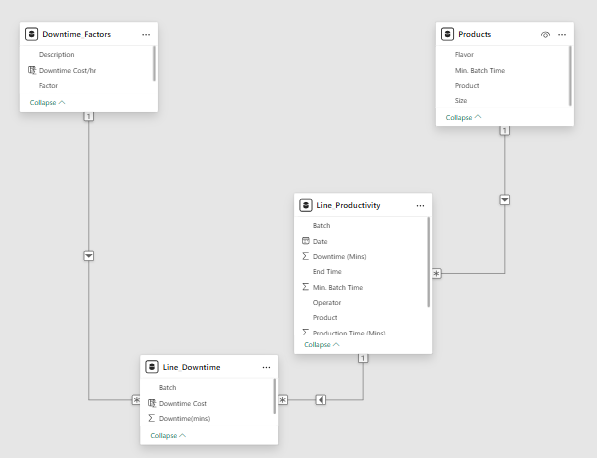

# Project Background
Jones Soda, a specialty beverage manufacturer known for its flavored sodas, initiated a production analysis project aimed at **reducing operational inefficiencies caused by recurring production line downtime**. The project was commissioned in response to rising internal costs, inconsistent batch performance, and delayed order fulfillment attributed to both machine malfunctions and operator errors.

The primary objective of this project is to analyze, visualize, and interpret production line data with a specific focus on **identifying root causes of downtime, quantifying their impact on operational performance, and providing actionable insights that will help Jones Soda reduce downtime by at least 50%**.
  

### Key Analysis & Recommendation Areas
* Machine-Side Downtime Diagnosis:
Identifies and quantifies downtime due to machine-related issues (e.g., failures, jams, inventory shortages). 

* Operator Performance Review:
Evaluates operator-specific errors, including machine misadjustments and inefficiencies during batch changes. Tracks downtime minutes and costs attributable to each operator, and pinpoints common error types.

* Operator-Machine Specialization Profiling:
Attempts to determine which operators perform best on which product machines by comparing error type frequency to number of batches handled—guiding smarter workforce assignments.

* Product-Level Vulnerability Assessment:
Maps downtime causes across different soda products (e.g., Cola, Lemon Lime, Orange).   

*Interact with the dashboard here*

*SQL Queries used to inspect and perform analysis can be found here*    

# Data Structure

Jones' data contains four tables: downtime factors, products, line productivity, line downtime.

# Executive Summary
Over a 5-day observation period covering 4 operators and 38 production batches, Jones Soda experienced a level of downtime that significantly impacted operational efficiency and financial performance. 

In total, 1,388 minutes of production were lost due to inefficiencies on the operators' side and product machines' side. When converted into hours, this adds up to approximately 23.13 hours, almost equivalent to losing all operator's full shift of production time just within a single working week.

Financially, the cost of this downtime is considerable. At the rate of $500 per hour of downtime, the total loss amounted to $11,566.67 that could otherwise be allocated to growth activities, maintenance improvements, or employee development. The severity of the financial impact, especially over such a short time frame, underscores the urgent need to identify and eliminate the root causes of downtime.

On average, each batch experienced 36.5 minutes of downtime and an average downtime cost of $304.39 per batch without even factoring in additional losses from potential product waste, overtime, or missed delivery windows.

The sections that follow will explore which machines, operators, and factors are contributing most to this problem and offer targeted recommendations for cutting downtime by at least 50%.

# Insights

